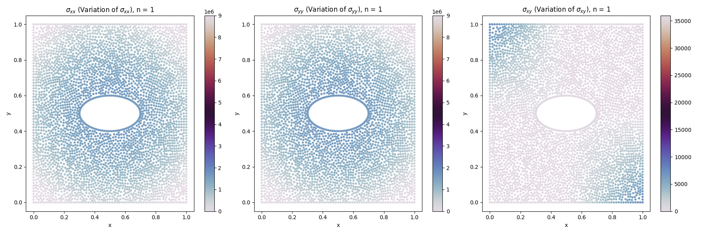
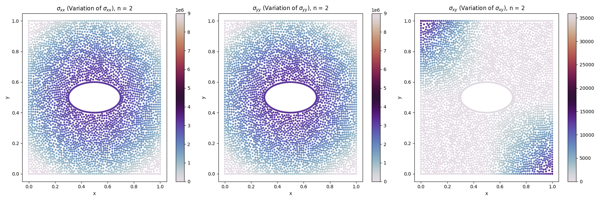
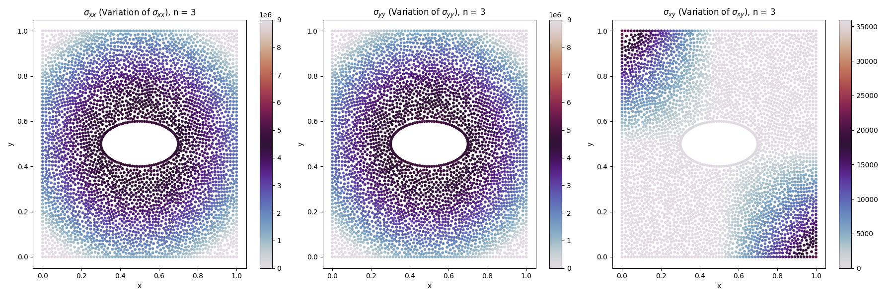
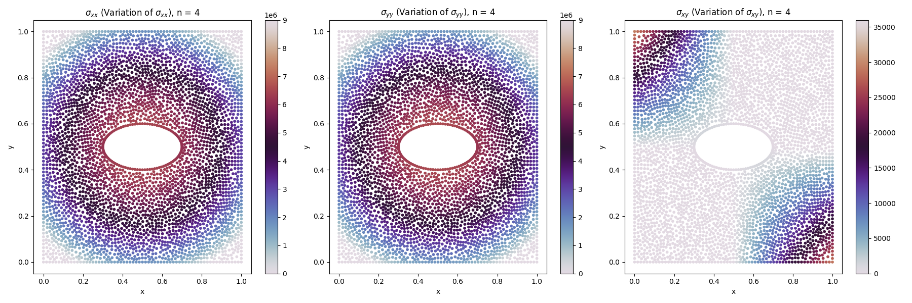
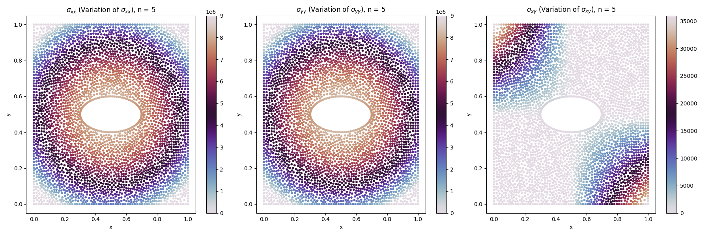

# Displacement-controlled Loading Analysis

## Overview
This project analyzes displacement-controlled loading of materials using data-driven approaches. The workflow involves three main steps:
1. **Polynomial Regression:** Generate polynomial equations for displacement components (`u_x` and `u_y`) using `polynomial.py`.
2. **Optimization:** Calculate Lamé constants (`λ` and `μ`) and minimize the cost function using `lameconstant.py`.
3. **Stress Visualization:** Plot stress variation (`σ_xx`, `σ_yy`, `σ_xy`) for the material using `distribution.py`.

## File Descriptions

1. `polynomial.py`
    - **Purpose:** Perform polynomial regression on displacement data to model `u_x` and `u_y`.
    - **Key Outputs:**
        - Polynomial equations for `u_x` and `u_y`.
        - Prediction vs. Actual plots for displacement components.


2. `lameconstant.py`
    - **Purpose:** Optimize Lamé constants (`λ` and `μ`) based on Navier’s equations and boundary constraints.
    - **Key Outputs:**
        - Optimized Lamé constants.
        - Cost function value for training and test datasets.

3. `distribution.py`
    - **Purpose:** Visualize stress variations (`σ_xx`, `σ_yy`, `σ_xy`) across the material.
    - **Key Outputs:**
        - Scatter plots for stress components at various points.

4. `main.py`
    - **Purpose:** Integrates the workflow for all five datasets in the `data/` directory.
    - **Steps:**
        1. Call `polynomial_obtain` to compute `u_x` and `u_y`.
        2. Optimize Lamé constants using `lame_constants`.
        3. Plot stress distributions for each dataset.


## How to Run

1. **Ensure Dependencies Are Installed:**
   ```bash
   pip install -r requirements.txt
    ```
2. **Place Data in the data/ Directory:**

    Each subfolder (e.g., 1, 2, ...) should contain:
    - displacement_data.csv
    - reaction_data.csv

3. **Run the Main Script:**
    ```bash
   python main.py
    ```

## Outputs

1. Polynomial Regression:
    - Equations for u_x and u_y.
    - Prediction vs. Actual plots.

2. Lamé Constants Optimization:
    - Optimized values of λ and μ.

3. Stress Distribution:
    - Scatter plots for σ_xx, σ_yy, and σ_xy.

---

# Report
## Derivation of Governing Equations
### Displacement Field and Strain Components

The strain components are defined in terms of displacement gradients as follows:

**Normal Strains:**

$$
\epsilon_{xx} = \frac{\partial u_x}{\partial x}, \quad 
\epsilon_{yy} = \frac{\partial u_y}{\partial y}, \quad 
\epsilon_{zz} = \frac{\partial u_z}{\partial z}
$$

**Shear Strains:**

$$
\epsilon_{xy} = \frac{1}{2} \left(\frac{\partial u_x}{\partial y} + \frac{\partial u_y}{\partial x}\right)
$$

$$
\epsilon_{yz} = \frac{1}{2} \left(\frac{\partial u_y}{\partial z} + \frac{\partial u_z}{\partial y}\right)
$$

$$
\epsilon_{zx} = \frac{1}{2} \left(\frac{\partial u_z}{\partial x} + \frac{\partial u_x}{\partial z}\right)
$$


### Stress-Strain Relationship

The constitutive equations relating stress and strain components are:

**Normal Stresses:**

$$
\sigma_{xx} = \lambda(\epsilon_{xx} + \epsilon_{yy} + \epsilon_{zz}) + 2\mu\epsilon_{xx}
$$

$$
\sigma_{yy} = \lambda(\epsilon_{xx} + \epsilon_{yy} + \epsilon_{zz}) + 2\mu\epsilon_{yy}
$$

$$
\sigma_{zz} = \lambda(\epsilon_{xx} + \epsilon_{yy} + \epsilon_{zz}) + 2\mu\epsilon_{zz}
$$

**Shear Stresses:**

$$
\sigma_{xy} = 2\mu\epsilon_{xy}, \quad 
\sigma_{yz} = 2\mu\epsilon_{yz}, \quad 
\sigma_{zx} = 2\mu\epsilon_{zx}
$$


### Stress Equilibrium Equations

The equations of equilibrium in the absence of body forces are:

$$
\frac{\partial \sigma_{xx}}{\partial x} + \frac{\partial \sigma_{xy}}{\partial y} + \frac{\partial \sigma_{xz}}{\partial z} = 0
$$

$$
\frac{\partial \sigma_{yx}}{\partial x} + \frac{\partial \sigma_{yy}}{\partial y} + \frac{\partial \sigma_{yz}}{\partial z} = 0
$$

$$
\frac{\partial \sigma_{zx}}{\partial x} + \frac{\partial \sigma_{zy}}{\partial y} + \frac{\partial \sigma_{zz}}{\partial z} = 0
$$


### Deriving Governing Equations

Substituting the stress-strain relationships into the equilibrium equations and expressing strains in terms of displacements yields:

**X-Direction:**

$$
(\lambda+2\mu)\frac{\partial^{2}u_x}{\partial x^{2}}+\mu\left(\frac{\partial^{2}u_x}{\partial y^{2}}+\frac{\partial^{2}u_x}{\partial z^{2}}\right)+(\lambda+\mu)\left(\frac{\partial^{2}u_y}{\partial x\partial y}+\frac{\partial^{2}u_z}{\partial x\partial z}\right)=0
$$

**Y-Direction:**

$$
(\lambda+2\mu)\frac{\partial^{2}u_y}{\partial y^{2}}+\mu\left(\frac{\partial^{2}u_y}{\partial x^{2}}+\frac{\partial^{2}u_y}{\partial z^{2}}\right)+(\lambda+\mu)\left(\frac{\partial^{2}u_x}{\partial x\partial y}+\frac{\partial^{2}u_z}{\partial y\partial z}\right)=0
$$

**Z-Direction:**

$$
(\lambda+2\mu)\frac{\partial^{2}u_z}{\partial z^{2}}+\mu\left(\frac{\partial^{2}u_z}{\partial x^{2}}+\frac{\partial^{2}u_z}{\partial y^{2}}\right)+(\lambda+\mu)\left(\frac{\partial^{2}u_x}{\partial x\partial z}+\frac{\partial^{2}u_y}{\partial y\partial z}\right)=0
$$


### Final Governing Equations

The complete system of coupled partial differential equations governing the displacement field is:

$$
(\lambda+2\mu)\frac{\partial^{2}u_x}{\partial x^{2}}+\mu\left(\frac{\partial^{2}u_x}{\partial y^{2}}+\frac{\partial^{2}u_x}{\partial z^{2}}\right)+(\lambda+\mu)\left(\frac{\partial^{2}u_y}{\partial x\partial y}+\frac{\partial^{2}u_z}{\partial x\partial z}\right)=0
$$

$$
(\lambda+2\mu)\frac{\partial^{2}u_y}{\partial y^{2}}+\mu\left(\frac{\partial^{2}u_y}{\partial x^{2}}+\frac{\partial^{2}u_y}{\partial z^{2}}\right)+(\lambda+\mu)\left(\frac{\partial^{2}u_x}{\partial x\partial y}+\frac{\partial^{2}u_z}{\partial y\partial z}\right)=0
$$

$$
(\lambda+2\mu)\frac{\partial^{2}u_z}{\partial z^{2}}+\mu\left(\frac{\partial^{2}u_z}{\partial x^{2}}+\frac{\partial^{2}u_z}{\partial y^{2}}\right)+(\lambda+\mu)\left(\frac{\partial^{2}u_x}{\partial x\partial z}+\frac{\partial^{2}u_y}{\partial y\partial z}\right)=0
$$

---

## Objective Function

Find ( $\mu_x$ ) and ( $\mu_y$ ) using polynomial regression.

### Minimize:
$$
\sum_{i=1}^N \left( \text{residual\_u}_x(x_i, y_i; \lambda_x, \mu_x)^2 + \text{residual\_u}_y(x_i, y_i; \lambda_y, \mu_y)^2 \right)
$$
$$+$$
$$
(x=x_1) \left[ \frac{\partial u_x}{\partial x} + \frac{\partial u_y}{\partial y} + 2\mu_x \frac{\partial u_x}{\partial x} - \text{abs}(R_{4}) \right]^2 \times 100 \quad \text{(penalty)}
$$
$$+$$
$$
(y=y_1) \left[ \frac{\partial u_x}{\partial x} + \frac{\partial u_y}{\partial y} + 2\mu_y \frac{\partial u_y}{\partial y} - \text{abs}(R_{1}) \right]^2 \times 100 \quad \text{(penalty)}
$$

### Physical Constraints:
$$
\lambda > 0 \quad \text{and} \quad \mu > 0
$$


## Algorithm for Parameter Identification

1. **Split the data from each file**: \( 60\% \) (training) / \( 40\% \) (testing).  
2. **Use Polynomial Regression** to find \( u_x \) and \( u_y \).  
3. **Find the further derivatives** using differentiation.  
4. **Define residuals** from \( u_x \) and \( u_y \) calculated above.  
5. **Define boundary conditions**: \(x = 1, y = 1\).  
6. **Define the objective function**.  
7. **Set bounds**: \( 1e6 \) to \( 1e12 \), ensuring equality is valid for the given material.  
8. **Use the Nelder-Mead numerical method** to minimize the cost function.  
9. **Evaluate** by:  
   - Optimizing on training data.  
   - Calculating the objective function and checking the fit.

---

## Nelder-Mead Algorithm

**If** \( f(R) < f(G) \), **then** perform **Case(i)** (Reflect/Expand)  
**Else** perform **Case(ii)** (Contract/Shrink)

### Case(i)

**Begin {Case(i)}**

1. **If** \( f(B) < f(R) \),  
   **then** replace \( W \) with \( R \).  
2. **Else**:
   - Compute \( E \) and \( f(E) \).
   - **If** \( f(E) < f(B) \),  
     **then** replace \( W \) with \( E \).  
   - **Else**, replace \( W \) with \( R \).
   - **End if**

**End {Case(i)}**


### Case(ii)

**Begin {Case(ii)}**

1. **If** \( f(R) < f(W) \),  
   **then** replace \( W \) with \( R \).  
   Compute \( C \) as:
   - \( C = (W + M)/2 \),  
   - or \( C = (M + R)/2 \),  
     and \( f(C) \).

2. **If** \( f(C) < f(W) \),  
   **then** replace \( W \) with \( C \).  
3. **Else**:
   - Compute \( S \) and \( f(S) \).  
   - Replace \( W \) with \( S \).  
   - Replace \( G \) with \( M \).
4. **End if**

**End {Case(ii)}**

---

## Distribution Graphs

1. **Stress Distribution for n = 1**

2. **Stress Distribution for n = 2**

3. **Stress Distribution for n = 3**

4. **Stress Distribution for n = 4**

5. **Stress Distribution for n = 5**
